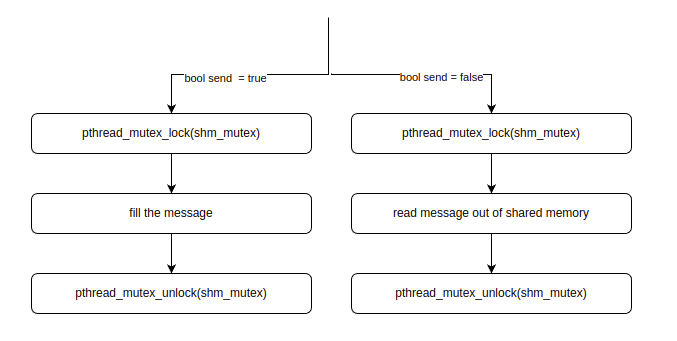
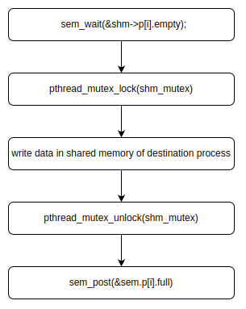
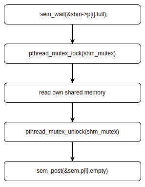
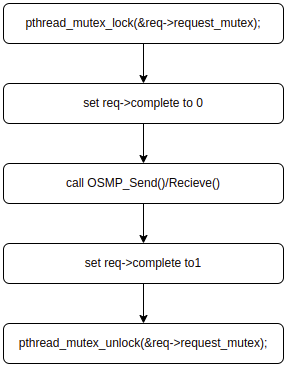
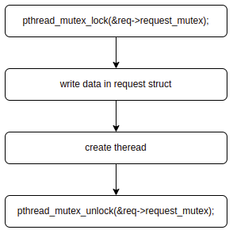
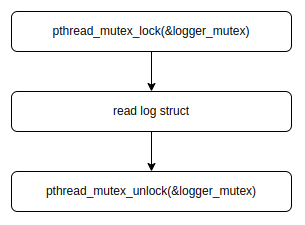
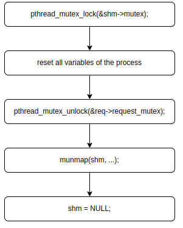

# OSMP - Operating System Message Passing
by [Felix Grüning](https://www.linkedin.com/in/felix-grüning-19443a280/) and [Patrick Zockol](https://www.linkedin.com/in/patrick-zockol-687204253/)

## Execution

### Make
1. Navigate to the project directory in the terminal
2. `chmod +x ./makeall.sh`
3. `chmod +x ./testall.sh`
4. `./makeall.sh`

### Syntax
To start the program, follow these steps:
1. Navigate to the project directory in the terminal
2. `./build/bin/osmp [NUMBER OF PROCESSES] ./build/bin/osmpexecutable {0-9/1337}`

Furthermore, there is an optional Logger syntax:

- `-L {Path}` activates the Logger
- `-v {1-3}` (optional) sets the strength of the Logger

The Logger strengths are defined as follows:

- `1` - Default selection if -v is not given. Includes start and end of function calls
- `2` - Includes everything from 1, as well as all ERROR calls, if any occur
- `3` - Includes everything from 1 and 2, including all `calloc()` and `free()` calls

Example calls:

- `./build/bin/osmp 500 ./build/bin/osmpexecutable 2` Normal start of the 2nd test
- `./build/bin/osmp 500 -L ./ ./build/bin/osmpexecutable 2` Start with log files in ./
- `./build/bin/osmp 500 -L ./ -v 3 ./build/bin/osmpexecutable 2` Start with log files in ./ with strength 3

Furthermore, there is a `testall.sh` in the project folder, which calls all tests with predefined parameters. A `./logs/` folder is created in the project directory, in which the logs of all tests are then stored.


## Structure of Shared Memory

### Fixed Values

- `MESSAGE_MAX_MESSAGE_PROC = 16`  Maximum number of messages that a process can have in the mailbox

- `OSMP_MAX_PALOAD_LENGTH = 1024`  Maximum length of the message in bytes

- `OSMP_MAX_SLOTS = 255`  Maximum number of all messages that can be present in the system

- `SharedMemName = "/shm"`  Name of the Shared Memory

- `OSMP_ERROR = -1` Variable that is returned when a function or process was stopped and has an error

- `OSMP_SUCCESS = 0` Variable that is returned when a function or process has run without errors

### SharedMemory Structure

```c
typedef struct {
    int processAmount;
    pthread_mutex_t mutex;
    pthread_cond_t cattr;
    Bcast broadcastMsg;
    int barrier_all;
    int barrier_all2;
    sem_t messages;
    logger log;
    process p[];
} SharedMem;
```

We introduce a new struct named "Shared-Memory", which includes the following contents:

- *`int processAmount;`*
Number of processes that were entered at the start of the program
- *`pthread_mutex_t mutex;`*
The mutex responsible for blocking processes that want to access the Shared Memory simultaneously
- *`pthread_cond_t cattr;`*
The condition that waits when the Barrier function is called
- *`Bcast broadcastMsg;`*
The Bcast struct, which is responsible for the Broadcast Message
- *`int barrier_all;`*
The termination condition that ends the barrier if initially barrier_all2 was 0
- *`int barrier_all2;`*
The termination condition that ends the barrier if initially barrier_all was 0
- *`sem_t messages;`*
The semaphore, which blocks processes with incoming messages once the maximum number of active messages in the system is reached
- *`logger log;`*
The log struct, which contains the Logger-Path and Logger-Intensity
- *`process p[];`*
A struct array, which contains all process data such as `pid` and `rank` of the respective process

### Message Structure

```c
typedef struct {
    int srcRank;
    char buffer[OSMP_MAX_PAYLOAD_LENGTH];
    size_t msgLen;
} message;
```

- *`int srcRank;`*
This integer stores the rank of the sending process
- *`char buffer[OSMP_MAX_PAYLOAD_LENGTH];`*
This array contains the received message or '\0' if no message was received
- *`size_t msgLen;`*
Actual length of the received message in bytes

## Process Structure


```c
typedef struct {
    message msg[OSMP_MAX_MESSAGES_PROC];
    pid_t pid;
    int rank;
    int firstEmptySlot;
    int firstmsg;
    sem_t empty;
    sem_t full;
} process;
```

- *`message msg[OSMP_MAX_MESSAGES_PROC];`*
The Message-Struct which contains the messages of its own process. It has a capacity of `OSMP_MAX_MESSAGE_PROC`
- *`pid_t pid;`*
The process number of the process
- *`int rank;`*
The rank of the process
- *`int firstEmptySlot;`*
The next free message slot. It is equal to `OSMP_MAX_MESSAGE_PROC` if all places are occupied
- *`int firstmsg;`*
The index of the last described message slot
- *`sem_t empty;`*
The semaphore that waits when the process can no longer receive messages
- *`sem_t full;`*
The semaphore that waits when the process has no messages

### Broadcast Structure


```c
typedef struct {
    char buffer[OSMP_MAX_PAYLOAD_LENGTH];
    size_t msgLen;
    int srcRank;
} Bcast;
```

- *`char buffer[OSMP_MAX_PAYLOAD_LENGTH];`*
The buffer for the B-cast with the size of `OSMP_MAX_PAYLOAD_LENGTH`
- *`size_t msgLen;`*
Actual length of the received message in bytes
- *`int srcRank;`*
This integer stores the rank of the sending process

### Logger Structure


```c
typedef struct {
    int logIntensity;
    char logPath[256];
    pthread_mutex_t mutex;
} logger;
```

- *`int logIntensity;`*
The log intensity variable that is passed
- *`char logPath[256];`*
The logging path that is passed
- *`pthread_mutex_t mutex;`*
The mutex that protects the struct access

## Usage of Semaphores and Mutexes

**NOTE:**
The code snippets provided here are pseudo-code for illustrative purposes and may not follow the C99 standard.

Here we explain the usage of semaphores and mutexes in our OSMP project:

We use a total of 3 semaphores in our program. One semaphore is for messages and is responsible for blocking processes when there are more than 256 messages. The other two semaphores are used to make the writing processes wait when the mailbox is full and the reading processes wait when the mailbox is empty.

We also use 3 mutexes to protect against multiple accesses to the shared memory and other structs.

### OSMP_Barrier

The `pthread_mutex_lock` call blocks access to the mutex by other processes and locks the mutex. It checks if n-1 processes have already reached the barrier. If the condition is false, it puts the process in a waiting state by calling `pthread_cond_wait`, which releases the mutex to allow other processes to access the mutex. If the condition is true, the following steps are performed:

1. `pthread_cond_broadcast(&shm->cattr)` is called to release all waiting processes.
2. Process n calls `pthread_mutex_unlock` to allow a process waiting in the queue to proceed.

When the process comes out of the waiting state (due to `pthread_cond_broadcast` and the subsequent unlock), it attempts to lock the mutex again and check the condition. If the condition is true, `pthread_mutex_unlock` is called. If the condition continues to be false, the process goes back to the waiting state. This is repeated until all processes have left the barrier.


### OSMP_Bcast

First, the `OSMP_Bcast` checks whether the function was called by the sending or receiving processes. The usage of mutexes is the same for both variants. It attempts to lock the mutex and then writes/reads the message, and releases the mutex again.



### OSMP_Send

The `OSMP_Send` first checks if the value of the `sem_t empty` semaphore is not 0. This semaphore is initialized to `OSMP_MAX_MESSAGES_PROC`. If there are still fewer than `OSMP_MAX_MESSAGES_PROC` messages received, the process proceeds and decrements the semaphore by one. Then it requests the mutex of the shared memory, and once successful, it writes to the shared memory of the receiving process. After that, it releases the mutex and calls `sem_post()` to allow the (waiting) receiver process to read the message.



### OSMP_Recv

The `OSMP_Recv` first checks if the `sem_t full` semaphore is free. This semaphore is initialized to 0. If a message has arrived, the sending process calls `sem_post()` on the `sem_t full` semaphore, incrementing the semaphore by one. Only then can the receiving process enter the function. It then requests the mutex of the shared memory, and once the mutex is locked with `pthread_mutex_lock()`, it reads the message from its own shared memory. After that, it releases the mutex and calls `sem_post()` to allow the (waiting) sender process to write its message.



### *isend / *ircv

The mutexes here serve to protect the requests from simultaneous access. First, the mutex of the request is locked before the parameters are copied into the IRequest struct. Then the thread is created, and the mutex is released again. This ensures that no other thread accesses the request before it has been fully initialized.



### OSMP_ISend

To avoid simultaneous access to the request, the mutex of the request structure is first locked. Then the parameters of the request are passed to the function, and a new thread is created to execute the `*isend()` function. Once the thread is created, the mutex of the request structure is released to allow other processes to access the request.



### OSMP_Irecv

First, the mutex of the IRequest structure, pointed to by the request, is locked to prevent simultaneous access to the request. Then the parameters of the request are copied to the function's parameters. Then a new thread is created, calling `*ircv()` function. Once the thread is created, the mutex of the IRequest structure is released to allow other processes to access the request.


### Debug

The mutex of the logger is used in the function. Access to the log struct is blocked while the mutex is locked. Once the variable has been read, the mutex is released.



### OSMP_Finalize

In `OSMP_Finalize`, the process first locks the mutex of the shared memory. After locking the mutex, it resets all variables of the process that called it and releases the mutex again. Then, `munmap()` is called to detach the process from the memory.



# Thank you for reading!
###


## Support

If you found this helpful and like the project, consider buying us a coffee:

[](https://www.paypal.com/paypalme/fegrue)
